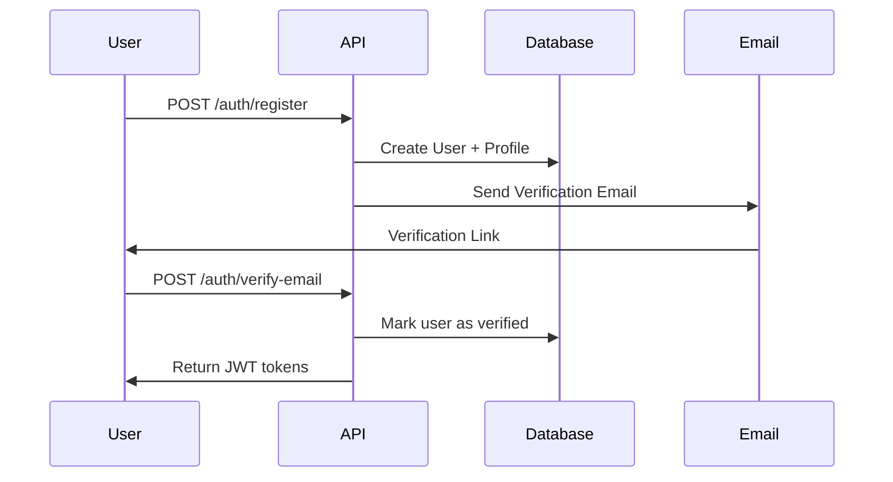
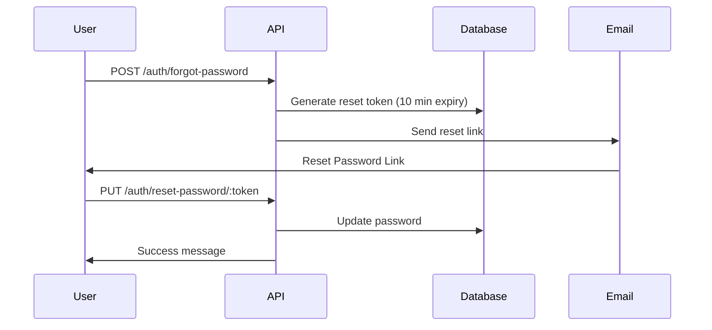

# Authentication & User Management System

**Production-Ready Implementation**

This document provides a comprehensive overview of the authentication and user management features implemented in the Campus Management System backend.

---

## 📋 Table of Contents

1. [Features Overview](#features-overview)
2. [System Architecture](#system-architecture)
3. [Authentication Flow](#authentication-flow)
4. [API Endpoints](#api-endpoints)
5. [Email Service](#email-service)
6. [File Upload (Cloudinary)](#file-upload-cloudinary)
7. [Security Features](#security-features)
8. [Error Handling](#error-handling)
9. [Testing](#testing)
10. [Frontend Integration](#frontend-integration)

---

## ✅ Features Overview

### Implemented Features (Production-Ready)

- ✅ **User Registration** - Student, Faculty, and Admin roles
- ✅ **Email Verification** - SHA256 hashed tokens with real SMTP delivery
- ✅ **JWT Authentication** - Access tokens (15 min) + Refresh tokens (7 days)
- ✅ **Login/Logout** - Secure session management
- ✅ **Password Reset Flow** - Forgot password with email delivery
- ✅ **Profile Management** - CRUD operations for user profiles
- ✅ **Profile Photo Upload** - Cloudinary CDN integration
- ✅ **Password Change** - Authenticated users can update passwords
- ✅ **Role-Based Access Control** - Admin, Faculty, Student permissions
- ✅ **Rate Limiting** - 100 requests per 15 minutes
- ✅ **Security Hardening** - Helmet, XSS protection, CORS

### Not Implemented (Future Enhancement)

- ❌ **2FA (Two-Factor Authentication)** - Can be added later without breaking changes

---

## 🏗️ System Architecture

### Layered Architecture

```
┌─────────────────────────────────────┐
│         API Routes Layer            │
│   (authRoutes, userRoutes)          │
├─────────────────────────────────────┤
│      Middleware Layer               │
│  (auth, validation, upload, error)  │
├─────────────────────────────────────┤
│      Controllers Layer              │
│  (authController, userController)   │
├─────────────────────────────────────┤
│      Services Layer                 │
│  (emailService, jwtHelper)          │
├─────────────────────────────────────┤
│      Models Layer (Sequelize)       │
│  (User, Student, Faculty, Dept.)    │
├─────────────────────────────────────┤
│   Infrastructure Layer              │
│  (PostgreSQL, Cloudinary, SMTP)     │
└─────────────────────────────────────┘
```

### Technology Stack

- **Runtime:** Node.js + Express.js
- **Database:** PostgreSQL + Sequelize ORM
- **Authentication:** JWT (jsonwebtoken)
- **Password Hashing:** bcrypt (10 salt rounds)
- **Email:** NodeMailer (Gmail/SMTP)
- **File Storage:** Cloudinary CDN
- **Validation:** Joi schemas
- **Security:** Helmet, XSS-Clean, CORS, Rate Limiting
- **Logging:** Winston

---

## 🔐 Authentication Flow

### 1. Registration Flow



**Steps:**
1. User submits registration form
2. System creates user account and role-specific profile (Student/Faculty)
3. Verification token generated (SHA256 hashed)
4. Email sent via NodeMailer with verification link
5. User clicks link → Frontend sends token to `/verify-email`
6. Account activated + JWT tokens returned for immediate login

### 2. Login Flow

```
User → POST /auth/login (email, password)
     ↓
System checks: User exists? Password correct? Email verified?
     ↓
Generate: Access Token (15 min) + Refresh Token (7 days)
     ↓
Return: { user, accessToken, refreshToken }
```

### 3. Token Refresh Flow

```
Frontend → POST /auth/refresh (refreshToken)
         ↓
System verifies refresh token validity
         ↓
Generate new access token (15 min)
         ↓
Return: { accessToken }
```

**Usage:** When access token expires, frontend automatically refreshes it without re-login.

### 4. Password Reset Flow



---

## 🔌 API Endpoints

### Authentication Endpoints (Public)

| Method | Endpoint | Description | Auth Required |
|--------|----------|-------------|---------------|
| POST | `/api/v1/auth/register` | User registration | ❌ |
| POST | `/api/v1/auth/login` | User login | ❌ |
| POST | `/api/v1/auth/verify-email` | Verify email with token | ❌ |
| POST | `/api/v1/auth/refresh` | Refresh access token | ❌ |
| POST | `/api/v1/auth/logout` | Logout (client-side) | ❌ |
| POST | `/api/v1/auth/forgot-password` | Request password reset | ❌ |
| PUT | `/api/v1/auth/reset-password/:token` | Reset password | ❌ |

### User Management Endpoints (Protected)

| Method | Endpoint | Description | Auth Required | Role |
|--------|----------|-------------|---------------|------|
| GET | `/api/v1/users/me` | Get own profile | ✅ | Any |
| PUT | `/api/v1/users/me` | Update own profile | ✅ | Any |
| POST | `/api/v1/users/me/profile-picture` | Upload profile photo | ✅ | Any |
| PUT | `/api/v1/users/change-password` | Change password | ✅ | Any |
| GET | `/api/v1/users` | List all users (paginated) | ✅ | Admin |

**Authentication Format:**
```http
Authorization: Bearer <accessToken>
```

---

## 📧 Email Service

### Implementation Details

**File:** `src/utils/emailService.js`

**Features:**
- ✅ Real SMTP email delivery via NodeMailer
- ✅ Support for Gmail and custom SMTP servers
- ✅ Graceful fallback to mock mode if not configured
- ✅ Error handling and logging
- ✅ Transporter verification on startup

### Configuration

#### Option 1: Gmail (Recommended)

```env
EMAIL_SERVICE=gmail
EMAIL_USER=your-email@gmail.com
EMAIL_PASSWORD=your-gmail-app-password
EMAIL_FROM=Campus System <noreply@campus.com>
```

**Gmail App Password Setup:**
1. Enable 2FA on your Google Account
2. Go to: Google Account → Security → App Passwords
3. Generate password for "Mail"
4. Use the 16-character password in `EMAIL_PASSWORD`

#### Option 2: Custom SMTP

```env
EMAIL_SERVICE=smtp
EMAIL_HOST=smtp.yourdomain.com
EMAIL_PORT=587
EMAIL_SECURE=false
EMAIL_USER=your-smtp-username
EMAIL_PASSWORD=your-smtp-password
EMAIL_FROM=Campus System <noreply@yourdomain.com>
```

### Email Templates

**1. Email Verification**
```
Subject: Hesap Doğrulama
Body: Hesabınızı doğrulamak için: {FRONTEND_URL}/verify-email/{token}
```

**2. Password Reset**
```
Subject: Şifre Sıfırlama İsteği
Body: Şifrenizi sıfırlamak için: {FRONTEND_URL}/reset-password/{resettoken}
```

### Mock Mode

If `EMAIL_USER` and `EMAIL_PASSWORD` are not configured:
- System operates in **mock mode**
- Email content logged to console (for development)
- No actual emails sent
- All other functionality works normally

---

## 📸 File Upload (Cloudinary)

### Implementation Details

**File:** `src/middleware/uploadMiddleware.js`

**Features:**
- ✅ Cloud storage via Cloudinary CDN
- ✅ Automatic image optimization (max 800x800px)
- ✅ File type validation (jpg, jpeg, png)
- ✅ File size limit (5MB)
- ✅ Unique filename generation
- ✅ Organized folder structure

### Configuration

```env
CLOUDINARY_CLOUD_NAME=your_cloud_name
CLOUDINARY_API_KEY=your_api_key
CLOUDINARY_API_SECRET=your_api_secret
```

**Get credentials from:** https://cloudinary.com/console

### Upload Process

```javascript
// Frontend (JavaScript/React)
const formData = new FormData();
formData.append('profile_image', file);

fetch('/api/v1/users/me/profile-picture', {
  method: 'POST',
  headers: {
    'Authorization': `Bearer ${accessToken}`
  },
  body: formData
});
```

**Response:**
```json
{
  "success": true,
  "message": "Profil fotoğrafı güncellendi.",
  "data": {
    "profilePictureUrl": "https://res.cloudinary.com/.../profile_userid_timestamp.jpg",
    "cloudinaryPublicId": "kampus-profil-fotolari/profile_userid_timestamp"
  }
}
```

### File Constraints

- **Max Size:** 5MB
- **Formats:** JPG, JPEG, PNG
- **Transformation:** Auto-resize to 800x800px (maintain aspect ratio)
- **Storage:** Cloudinary folder `kampus-profil-fotolari`

---

## 🔒 Security Features

### 1. Password Security

- **Hashing:** bcrypt with 10 salt rounds
- **Stored:** Only hashed passwords in database
- **Validation:** Minimum 8 characters, 1 uppercase, 1 lowercase, 1 number

### 2. JWT Security

- **Algorithm:** HS256
- **Access Token:** 15 minutes expiry
- **Refresh Token:** 7 days expiry
- **Storage:** Client-side (localStorage/sessionStorage)
- **Secret:** Environment-based (never hardcoded)

### 3. Token Security

- **Email Verification:** SHA256 hashed, one-time use
- **Password Reset:** SHA256 hashed, 10-minute expiry
- **Storage:** Hashed tokens in database

### 4. HTTP Security

- **Helmet:** Sets secure HTTP headers
- **CORS:** Whitelist frontend origins only
- **XSS Protection:** XSS-Clean middleware
- **Rate Limiting:** 100 requests per 15 minutes per IP

### 5. Database Security

- **Prepared Statements:** Sequelize ORM prevents SQL injection
- **Field Exclusion:** Sensitive fields never returned in API responses
- **Validation:** Joi schemas validate all inputs

---

## ⚠️ Error Handling

### Centralized Error Handler

**File:** `src/middleware/error.js`

**Handles:**
- ✅ Multer file upload errors (size, type, field)
- ✅ Sequelize database errors (validation, unique, format)
- ✅ JWT errors (invalid, expired)
- ✅ Custom business logic errors
- ✅ Generic server errors

### Error Response Format

```json
{
  "success": false,
  "error": "Error message in Turkish"
}
```

### Common Error Codes

| Code | Meaning | Example |
|------|---------|---------|
| 400 | Bad Request | Invalid input, validation error |
| 401 | Unauthorized | Invalid/expired token |
| 403 | Forbidden | Insufficient permissions |
| 404 | Not Found | User/resource not found |
| 429 | Too Many Requests | Rate limit exceeded |
| 500 | Server Error | Unexpected server error |

---

## 🧪 Testing

### Manual Testing Checklist

**Registration Flow:**
- [ ] Register with valid student data
- [ ] Register with valid faculty data
- [ ] Try duplicate email (should fail)
- [ ] Check email received (or logged in mock mode)
- [ ] Verify email with token
- [ ] Try login before verification (should fail)

**Login Flow:**
- [ ] Login with correct credentials
- [ ] Login with wrong password (should fail)
- [ ] Login with unverified account (should fail)
- [ ] Check tokens returned

**Token Refresh:**
- [ ] Use refresh token to get new access token
- [ ] Try expired refresh token (should fail)

**Password Reset:**
- [ ] Request password reset
- [ ] Check email received
- [ ] Reset password with valid token
- [ ] Try expired token (should fail)
- [ ] Login with new password

**Profile Management:**
- [ ] Get own profile
- [ ] Update profile fields
- [ ] Upload profile picture
- [ ] Change password

### Testing Tools

**Recommended:** Postman, Thunder Client, or curl

**Example curl request:**
```bash
# Register
curl -X POST http://localhost:5000/api/v1/auth/register \
  -H "Content-Type: application/json" \
  -d '{
    "email": "test@example.com",
    "password": "Test123456",
    "role": "student"
  }'

# Login
curl -X POST http://localhost:5000/api/v1/auth/login \
  -H "Content-Type: application/json" \
  -d '{
    "email": "test@example.com",
    "password": "Test123456"
  }'

# Get Profile
curl -X GET http://localhost:5000/api/v1/users/me \
  -H "Authorization: Bearer YOUR_ACCESS_TOKEN"
```

---

## 🎨 Frontend Integration

### Complete Integration Example (React)

```javascript
// authService.js
const API_BASE = 'http://localhost:5000/api/v1';

export const authService = {
  // Register
  async register(data) {
    const response = await fetch(`${API_BASE}/auth/register`, {
      method: 'POST',
      headers: { 'Content-Type': 'application/json' },
      body: JSON.stringify(data)
    });
    return response.json();
  },

  // Login
  async login(email, password) {
    const response = await fetch(`${API_BASE}/auth/login`, {
      method: 'POST',
      headers: { 'Content-Type': 'application/json' },
      body: JSON.stringify({ email, password })
    });
    const data = await response.json();
    
    if (data.success) {
      localStorage.setItem('accessToken', data.data.accessToken);
      localStorage.setItem('refreshToken', data.data.refreshToken);
      localStorage.setItem('user', JSON.stringify(data.data.user));
    }
    
    return data;
  },

  // Verify Email
  async verifyEmail(token) {
    const response = await fetch(`${API_BASE}/auth/verify-email`, {
      method: 'POST',
      headers: { 'Content-Type': 'application/json' },
      body: JSON.stringify({ token })
    });
    const data = await response.json();
    
    if (data.success) {
      localStorage.setItem('accessToken', data.data.accessToken);
      localStorage.setItem('refreshToken', data.data.refreshToken);
    }
    
    return data;
  },

  // Refresh Token
  async refreshToken() {
    const refreshToken = localStorage.getItem('refreshToken');
    const response = await fetch(`${API_BASE}/auth/refresh`, {
      method: 'POST',
      headers: { 'Content-Type': 'application/json' },
      body: JSON.stringify({ refreshToken })
    });
    const data = await response.json();
    
    if (data.success) {
      localStorage.setItem('accessToken', data.accessToken);
    }
    
    return data;
  },

  // Logout
  logout() {
    localStorage.removeItem('accessToken');
    localStorage.removeItem('refreshToken');
    localStorage.removeItem('user');
  },

  // Get Access Token
  getAccessToken() {
    return localStorage.getItem('accessToken');
  },

  // Check if authenticated
  isAuthenticated() {
    return !!this.getAccessToken();
  }
};

// userService.js
export const userService = {
  // Get Profile
  async getProfile() {
    const token = authService.getAccessToken();
    const response = await fetch(`${API_BASE}/users/me`, {
      headers: {
        'Authorization': `Bearer ${token}`
      }
    });
    return response.json();
  },

  // Update Profile
  async updateProfile(data) {
    const token = authService.getAccessToken();
    const response = await fetch(`${API_BASE}/users/me`, {
      method: 'PUT',
      headers: {
        'Content-Type': 'application/json',
        'Authorization': `Bearer ${token}`
      },
      body: JSON.stringify(data)
    });
    return response.json();
  },

  // Upload Profile Picture
  async uploadProfilePicture(file) {
    const token = authService.getAccessToken();
    const formData = new FormData();
    formData.append('profile_image', file);
    
    const response = await fetch(`${API_BASE}/users/me/profile-picture`, {
      method: 'POST',
      headers: {
        'Authorization': `Bearer ${token}`
      },
      body: formData
    });
    return response.json();
  },

  // Change Password
  async changePassword(currentPassword, newPassword) {
    const token = authService.getAccessToken();
    const response = await fetch(`${API_BASE}/users/change-password`, {
      method: 'PUT',
      headers: {
        'Content-Type': 'application/json',
        'Authorization': `Bearer ${token}`
      },
      body: JSON.stringify({ currentPassword, newPassword })
    });
    return response.json();
  }
};

// axios interceptor for automatic token refresh
import axios from 'axios';

axios.interceptors.response.use(
  response => response,
  async error => {
    const originalRequest = error.config;
    
    if (error.response.status === 401 && !originalRequest._retry) {
      originalRequest._retry = true;
      
      const newToken = await authService.refreshToken();
      if (newToken.success) {
        originalRequest.headers['Authorization'] = `Bearer ${newToken.accessToken}`;
        return axios(originalRequest);
      }
    }
    
    return Promise.reject(error);
  }
);
```

---

## 📚 Additional Documentation

- **API Reference:** See `apidocumentation.json` for complete API specs
- **Environment Setup:** See `ENVIRONMENT_SETUP.md` for configuration guide
- **Database Models:** See `src/models/` for data schemas

---

## 🚀 Deployment Checklist

Before deploying to production:

- [ ] Set `NODE_ENV=production`
- [ ] Use strong random `JWT_SECRET` (32+ characters)
- [ ] Configure real SMTP email service
- [ ] Set production `FRONTEND_URL`
- [ ] Configure Cloudinary with production account
- [ ] Use secure PostgreSQL connection (SSL)
- [ ] Set appropriate CORS origins
- [ ] Enable database backups
- [ ] Set up error monitoring (Sentry, etc.)
- [ ] Configure logging to files
- [ ] Test all critical flows in production
- [ ] Document admin account creation process

---

## 🆘 Support & Contact

For issues or questions:
- Check `apidocumentation.json` for API specs
- Check `ENVIRONMENT_SETUP.md` for configuration
- Review error logs in console/files
- Test with Postman collection

---

**Version:** 1.0.0  
**Last Updated:** December 2025  
**Status:** Production Ready ✅

